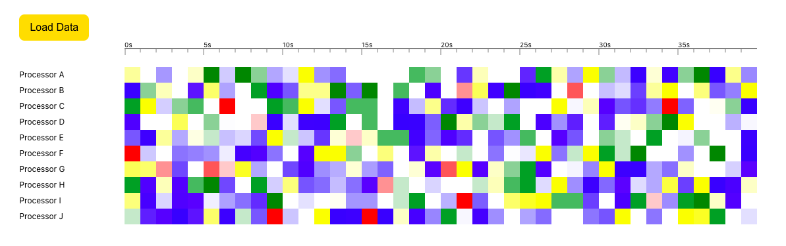

# Processor Status

## Getting started

- Clone the repository
- Run yarn or npm install
- Run yarn start or npm start to run locally
- Run yarn build or npm run build to make a build
- Run yarn deploy or npm run deploy to deploy to firebase hosting

The app is hosted in [https://processor-status.web.app](https://processor-status.web.app)

The app shows the processor status by time. Click on the "Load Data" button to generate some random data in the firestore database.

## Tasks

- Populate firestore
- Query
- Display timeline
- Display squares
- Display colors

## Data structure

- Processor collection with name
- EventSummary collection with
  - tick (number between 1 - 100)
  - errorCount (random between 0 - 5)
  - warningCount (random between 0 - 20)
  - successCount (random between 0 - 5)
  - infoCount (random between 0 - 100)
  - processorId

## Color of square

Display one color based on order of precedence: error (red), warning (yellow), success (green), info (blue)

## Data population

- Error: Randomise between 1 and 100. All values <= 95 is 0. errorCount = random - 95.
- Warning: Randomise between 1 and 100. All values <= 80 is 0. warningCount = random - 80.
- Success: Randomise between 1 and 10. All values <= 5 is 0. successCount = random - 5.
- Info: Ramdomise between 1 and 150. All values below 50 is 0. infoCount = random - 50.

There will be some cells with no events with this logic.
